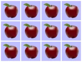

+++
author = "elkrot"
title = "Массивы C#. Инициализация"
date = "2021-03-27"
description = "Типы массивов C#. Инициализация массивов. Одномерные массивы. Многомерные массивы. Массив массивов."
tags = [
    "csharp",
	"arrays",
	"collections"
]
+++

Описаны **типы массивов C#** (одномерные массивы, многомерные массивы, массив массивов), **способы инициализации массивов** .<!--more-->

Одномерные массивы - Single-Dimensional Arrays
----------------------------------------------


```csharp
var r1 = new int[3] { 1, 2, 3 };
var r2 = new int[] { 1, 2, 3 };
var r3 = new[] { 1, 2,  5 };
int[] r4 = { 1, 3, 5 };
r4[0] = 7;
for ( int i=0; i < r4.Length; i++ )
{
    Console.Write( r4[i] );
}
```

<iframe width="100%" height="475" src="https://dotnetfiddle.net/Widget/G18XCd" frameborder="0"></iframe>

## Многомерные массивы - Multidimensional Arrays


```csharp
int[,] r2 = new int[2, 3];

var r3 = new int[2, 3] 
   { { 0, 1, 2 }, { 3, 4, 5 } };

var r4 = new int[,] 
   { { 0, 1, 2 }, { 3, 4, 5 } };

var r5 = new [,]
   { { 0, 1, 2 }, { 3, 4, 5 } };

int[,] r6 = 
   { { 0, 1, 2 }, { 3, 4, 5 } };
   
r6[1,2] = 7;
Console.WriteLine("r6.Rank = {0} ", r3.Rank);

foreach (var i in r6){
    Console.Write("{0} ", i);
}
```
<iframe width="100%" height="475" src="https://dotnetfiddle.net/Widget/FCZAJa" frameborder="0"></iframe>

## Массив массивов - Jagged Arrays


```csharp
int[][] r = new int[2][];
r[0] = new int[2] { 1, 2 };          
r[1] = new int[3] { 1, 2, 3 };       

var r2 = new int[3][];
r2[0] = new int[2] { 1, 2 };          
r2[1] = new int[1] { 1 };       
r2[2] = new int[5] {  4,1, 2, 3, 5 }; 

char[][,] r3 =  
{
    new char[,] 
    { {'H','e'} },
    new char[,] 
    { {'l','l'}, {'o',' '} },
    new char[,] 
    { {'w','o'}, {'r','l'},
	{'d', '!'} } 
};

foreach (var a1 in r3)
{
    foreach (var a2 in a1)
    {      
       Console.Write(a2); 
    }
}
```
<iframe width="100%" height="475" src="https://dotnetfiddle.net/Widget/ZVtzzv" frameborder="0"></iframe>

```csharp
int[] r0 = 
   {  3, 4, 5 };

int[,] r1 = 
   { { 0, 1, 2 }, { 3, 4, 5 } };

int[,,] r2 = 
   { 
        { {0, 1, 2}, {0, 1, 2} }
       ,{ {3, 4, 5}, {0, 1, 2} } 
       ,{ {3, 4, 5}, {0, 1, 2} }
       ,{ {3, 4, 5}, {0, 1, 2} }
       ,{ {3, 4, 5}, {0, 1, 2} }
    };
for (int i = 0; i < r2.Rank; i++)
{
   Console.Write( r2.GetLength(i)+",");       
}
var l = 1;
Console.WriteLine( l);
for (int i = 0; i < r2.Rank; i++)
{
    l*=r2.GetLength(i);
 
}
Console.WriteLine("");
Console.WriteLine(
"Length {0}=={1}",l,r2.Length);

Console.WriteLine(
"r0.Rank = {0} ", r0.Rank);
Console.WriteLine(
"r1.Rank = {0} ", r1.Rank);
Console.WriteLine(
"r2.Rank = {0} ", r2.Rank);   

foreach (int i in r2)
{
Console.Write(i);
}
```

- [dotnetfiddle.net](https://dotnetfiddle.net/)
- [arrays.workbook](https://drive.google.com/file/d/18q5UI8bbMxEDr8yULPnAnXyifB0dyJHZ/view?usp=sharing)

1. [metanit.com](https://metanit.com/sharp/tutorial/2.4.php)
2. [professorweb.ru](https://professorweb.ru/my/csharp/charp_theory/level4/4_1.php)
3. [w3schools.com](https://www.w3schools.com/cs/cs_arrays.asp)
4. [microsoft.com](https://docs.microsoft.com/en-us/dotnet/csharp/programming-guide/arrays/)
5. [google.com](https://www.google.com/search?q=arrays+csharp)